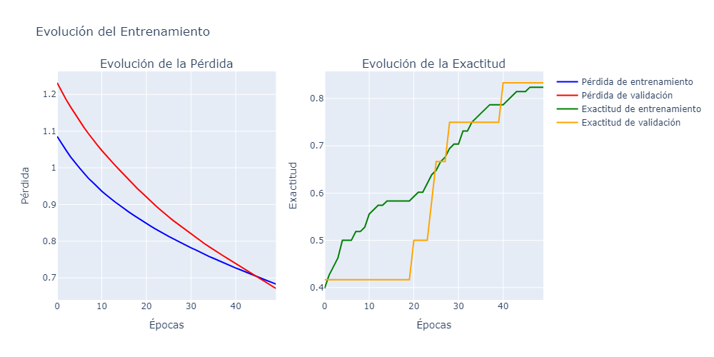
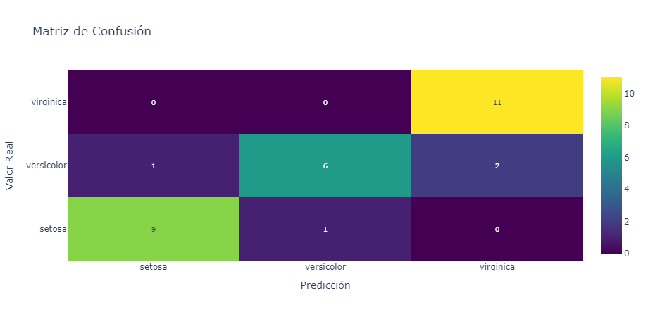
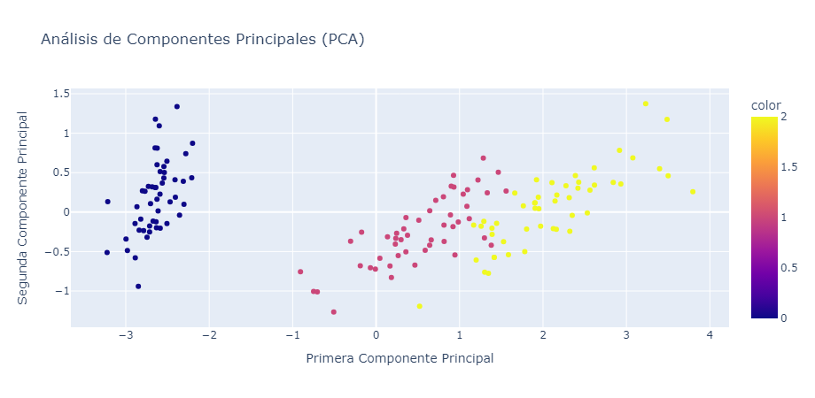

# Entrenamiento de Red Neuronal para Clasificación

Reporte de practicas

Kevin Ulises Covarrubias Pavón

## Descripción del dataset

Se utilizó el dataset Iris, disponible en librerías como `sklearn.datasets`, que consta de 150 muestras de flores Iris, cada una con 4 características. Se dividió el dataset en 80% para entrenamiento y 20% para prueba, y se ordenaron de forma aleatoria los datos de las muestras antes de la división para evitar sesgos en el orden de las clases.

Las características del dataset son:

- Largo del sépalo (`sepal_length`)
- Ancho del sépalo (`sepal_width`)
- Largo del pétalo (`petal_length`)
- Ancho del pétalo (`petal_width`)

Cada muestra está asociada a una de las tres especies: *Iris setosa*, *Iris versicolor* o *Iris virginica*. Estas clases se codificaron inicialmente como valores numéricos (0, 1 y 2) y, posteriormente, se convirtieron a formato *one-hot*, de modo que:

- *setosa* → [1, 0, 0]
- *versicolor* → [0, 1, 0]
- *virginica* → [0, 0, 1]

## Arquitectura de la red

La arquitectura utilizada fue:

- 4 neuronas en la capa de entrada, correspondientes a las 4 características.
- 8 neuronas en la primera y única capa oculta con función de activación *ReLU*.
- 3 neuronas en la capa de salida con activación *softmax*, correspondiente al número de especies de Iris.

Los hiperparámetros utilizados fueron:

- Optimizador: Adam
- Learning rate: 0.001 (valor típico para Adam)
- Función de pérdida: Entropía cruzada categórica (`categorical_crossentropy`), adecuada para 3 clases.
- Épocas: 50
- Batch size: 16

## Entrenamiento

La evolución de la pérdida fue progresiva, partiendo de 1.2 para el entrenamiento y de 1.1 para la validación, terminando en valores cercanos al 0.15, indicando una mejora en la clasificación al avanzar en cada época de forma consistente, como se muestra en la Figura 1.

*Figura 1: Evolución de la pérdida durante el entrenamiento.*

En cuanto a la evolución de la exactitud, partiendo de valores cercanos a 0.4 para el entrenamiento y la validación, termina en valores cercanos a 0.83 al final de las 50 épocas. Un detalle a resaltar en la validación es que, al ser más inestable, se mantiene estática en periodos prolongados y aumenta de forma abrupta, aunque sigue una tendencia al alza.

Se probó con 8 neuronas en la capa oculta, aunque no hubo un aumento significativo en la exactitud del modelo. De haberse requerido mayor capacidad, podría haberse incrementado el número de neuronas o añadido más capas. Sin embargo, para el tamaño del dataset Iris, esta arquitectura fue suficiente.

## Evaluación

La exactitud final tras entrenar durante 50 épocas fue del 87%.

*Figura 2: Evolución de la exactitud del modelo.*

## Conclusiones

En la separación de las tres especies en el análisis PCA, se observa una clara separación de la clase *setosa* frente a *versicolor* y *virginica*, como se muestra en la Figura 3. Sin embargo, *versicolor* y *virginica* presentan cierto solapamiento, lo cual coincide con la información que muestra la matriz de confusión. 

El modelo logró un buen desempeño, identificando perfectamente la clase *virginica* en el conjunto de prueba y con pocos errores en *setosa* y *versicolor*.

*Figura 3: Análisis PCA de la separación de especies.*

Entre las posibles mejoras al modelo se pueden considerar:

- Aumentar el número de muestras o aplicar técnicas de aumento de datos para mejorar la generalización.
- Explorar métodos de regularización para lograr un mejor equilibrio entre entrenamiento y validación, especialmente si se observaran signos de sobreajuste.

En conjunto, la red neuronal entrenada logra clasificar de manera bastante precisa las tres especies de Iris, con un rendimiento sólido y un comportamiento de entrenamiento estable, reflejado en las gráficas provistas.
